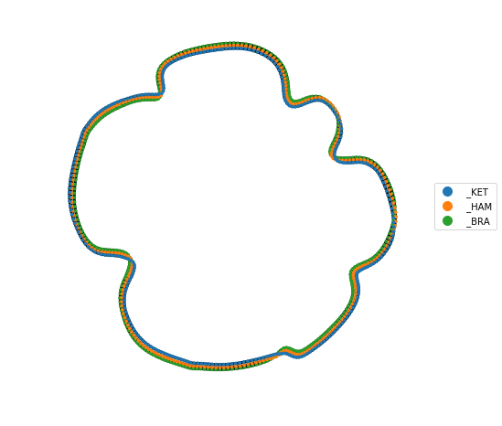
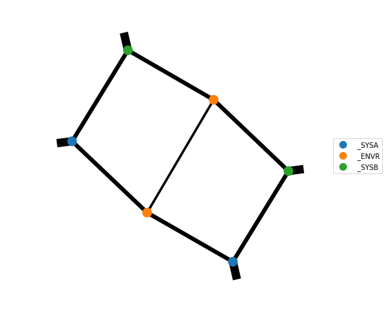

Periodic DMRG example
=====================

Setup
-----

Here we demonstrate 2-site periodic DMRG for the spin-1/2 Heisenberg model.

.. code-block:: python

    from quimb import *
    from quimb.tensor import *

    H = MPO_ham_heis(300, cyclic=True)

``quimb`` has the function ``heisenberg_energy`` which can calculate the analytic energy we are looking for:

.. code-block:: python

    >>> heisenberg_energy(300)
    -132.94690126514288

Let's create the core DMRG object that handles all the algorithm:

.. code-block:: python

    dmrg = DMRG2(H)

``DMRG2`` internally forms the needed energy and norm overlaps, reusing views of the same data. We can graph, for example, the full energy expectation:

.. code-block:: python

    %matplotlib inline
    dmrg.TN_energy.graph(color=['_KET', '_HAM', '_BRA'])  # might be slow as uses force repulsion

Solve
-----

The default algorithm settings are reasonable enough to get started with:

.. code-block:: python

    >>> dmrg.solve(max_sweeps=4, verbosity=1)
    SWEEP-1, direction=R, max_bond=8, cutoff:1e-08
    100%|█████████████████████████████████████████| 300/300 [00:10<00:00, 29.33it/s]
    Energy: -132.21204568414444 ... not converged.
    SWEEP-2, direction=R, max_bond=16, cutoff:1e-08
    100%|█████████████████████████████████████████| 300/300 [00:05<00:00, 54.29it/s]
    Energy: -132.86752103136382 ... not converged.
    SWEEP-3, direction=R, max_bond=32, cutoff:1e-08
    100%|█████████████████████████████████████████| 300/300 [00:13<00:00, 22.04it/s]
    Energy: -132.92751161559985 ... not converged.
    SWEEP-4, direction=R, max_bond=64, cutoff:1e-08
    100%|█████████████████████████████████████████| 300/300 [02:18<00:00,  2.16it/s]
    Energy: -132.9463361543647 ... not converged.

We are getting pretty close to the known energy already (closer than OBC at this length can get). The relative error is:

.. code-block:: python

    >>> (dmrg.energy - heisenberg_energy(300)) / heisenberg_energy(300)
    -4.250650243106969e-06

Note that for PBC, the algorithm splits the chain into segments, and approximates the other segments with a SVD. Thus progress appears to pause at these points. The number of singular values kept for this environment approximation is recorded in ``dmrg.bond_sizes_ham`` and ``dmrg.bond_sizes_norm``:

.. code-block:: python

    >>> dmrg.bond_sizes_norm
    [[1, 1], [1, 2], [1, 5], [4, 11]]

    >>> dmrg.bond_sizes_ham
    [[2, 2], [2, 3], [2, 6], [7, 16]]

To progress further might require tweaking the advanced options, for example, setting tighter tolerances for some of the settings found in:

.. code-block:: python

    >>> dmrg.opts
    {'default_sweep_sequence': 'R',
     'bond_compress_method': 'svd',
     'bond_compress_cutoff_mode': 'rel',
     'bond_expand_rand_strength': 1e-06,
     'local_eig_tol': 0.001,
     'local_eig_ncv': 4,
     'local_eig_backend': None,
     'local_eig_maxiter': None,
     'local_eig_EPSType': None,
     'local_eig_ham_dense': None,
     'local_eig_norm_dense': None,
     'periodic_segment_size': 0.5,
     'periodic_compress_method': 'isvd',
     'periodic_compress_norm_eps': 1e-06,
     'periodic_compress_ham_eps': 1e-06,
     'periodic_compress_max_bond': -1,
     'periodic_nullspace_fudge_factor': 1e-12,
     'periodic_canonize_inv_tol': 1e-10,
     'periodic_orthog_tol': 1e-06}

See :func:`~quimb.tensor.tensor_dmrg.get_default_opts` for detailed explanations of these quantities. One could also supply custom sequences for the maximum allowed bond dimensions (e.g. ``dmrg.solve(..., bond_dims=[70, 80, 90])``) or bond compression cutoffs (e.g. ``dmrg.solve(..., cutoffs=[1e-9, 3e-10, 1e-10])``).

The full state can be retrieved from ``dmrg.state``:

.. code-block:: python

    >>> gs = dmrg.state
    >>> gs.max_bond()
    64

From this we could for example compute a compressed density matrix of 50 + 50 = 100 adjacent qubits:

.. code-block:: python

    rho_ab = gs.partial_trace_compress(range(0, 50), range(50, 100))
    rho_ab.graph(color=['_SYSA', '_ENVR', '_SYSB'], show_inds=False, iterations=2000)

And check it is normalized:

.. code-block:: python

    >>> rho_ab.outer_dims_inds()
    ((4096, 'kA'), (4096, 'bA'), (4096, 'kB'), (4096, 'bB'))

    >>> rho_ab.trace(['kA', 'kB'], ['bA', 'bB'])
    1.0000000000000009
