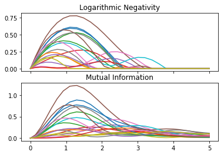

Quench Evolution Example
========================

Setup
-----

First we'll set up a 20 qubit random product state, and a sparse heisenberg hamiltonian to evolve it with:

.. code-block:: python

    import quimb as qu

    n = 20
    H = qu.ham_heis(n, sparse=True).real
    psi0 = qu.rand_product_state(n)

We can do a few checks on the system:

.. code-block:: python

    >>> # check normalization
    >>> qu.expectation(psi0, psi0)
    1.0000000000000004

    >>> # find the initial energy
    >>> qu.expec(H, psi0)
    0.3293389366972309

    >>> # find the initial variance in energy
    >>> psi0.H @ H @ H @ psi0
    matrix([[2.92484237+3.40005801e-16j]])

Let's also compare these checks to the total energy spectrum of the Hamiltonian ``H``:

.. code-block:: python

    >>> qu.bound_spectrum(H)
    (-8.904386529876453, 4.9999999999999964)

We can speed up that computation by taking advantage of the fact that ``H`` conserves z-spin and so projecting it into the 0 magnetization subspace:

.. code-block:: python

    >>> prj = qu.zspin_projector(n=20, sz=0)
    >>> qu.bound_spectrum(prj @ H @ prj.H)
    (-8.904386529876446, 5.000000000000006)

A lot quicker! And we can infer that our initial state has overlap between many states in the centre of the spectrum.

Evolution
---------

Now let's set up some things we want to compute while we evolve with the hamiltonian. Namely the logarithmic negativity and mutual information between neighbouring qubits. Since we'll use the default adaptive integrating scheme, we'll return the current time as well:

.. code-block:: python

    def compute(t, pt):
        """Perform computation at time ``t`` with state ``pt``.
        """
        dims = [2] * n
        sysa, sysb = i, i + 1
        lns = [qu.logneg_subsys(pt, dims, sysa, sysb) for i in range(n - 1)]
        mis = [qu.mutinf_subsys(pt, dims, sysa, sysb) for i in range(n - 1)]
        return t, lns, mis

Set up the evolution with the initial state, hamiltonian and the compute dict:

.. code-block:: python

    evo = qu.Evolution(psi0, H, compute=compute, progbar=True)

Update the evolution to ``t=5``. The functions in ``compute`` will be called at each step the integrator uses. If we had set ``method='solve'`` or ``method='expm'``, we should use the generator ``evo.at_times(ts)`` to specify the time steps when computation takes place.

.. code-block:: python

    >>> evo.update_to(5)
    100%|██████████| 100/100 [00:36<00:00,  3.36%/s]

We can extract the results of the computation from ``evo.results`` and plot them:

.. code-block:: python

    %matplotlib inline
    import matplotlib.pyplot as plt

    ts, lns, mis = zip(*evo.results)

    fig, axs = plt.subplots(2, 1, sharex=True)
    axs[0].plot(ts, lns);
    axs[0].set_title("Logarithmic Negativity")
    axs[1].plot(ts, mis);
    axs[1].set_title("Mutual Information")

    plt.show()

We can see that the classical correlations outlast the quantum correlations.

Finally, let's check that energy has been conserved in the current state at ``t=5``:

.. code-block:: python

    >>> qu.expec(H, evo.pt)
    0.3293389767015861
