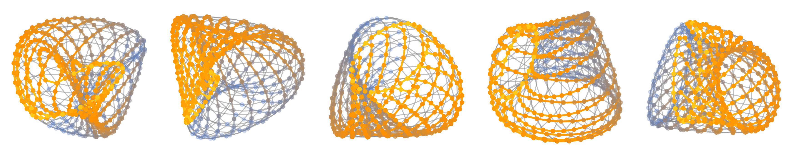

Welcome to quimb's documentation!
=================================

.. image:: https://github.com/jcmgray/quimb/actions/workflows/tests.yml/badge.svg
  :target: https://github.com/jcmgray/quimb/actions/workflows/tests.yml
  :alt: Tests
.. image:: https://codecov.io/gh/jcmgray/quimb/branch/main/graph/badge.svg
  :target: https://codecov.io/gh/jcmgray/quimb
  :alt: Code Coverage
.. image:: https://app.codacy.com/project/badge/Grade/3c7462a3c45f41fd9d8f0a746a65c37c
  :target: https://www.codacy.com/gh/jcmgray/quimb/dashboard?utm_source=github.com&amp;utm_medium=referral&amp;utm_content=jcmgray/quimb&amp;utm_campaign=Badge_Grade
  :alt: Code Quality
.. image:: https://readthedocs.org/projects/quimb/badge/?version=latest
  :target: http://quimb.readthedocs.io/en/latest/?badge=latest
  :alt: Documentation Status
.. image:: http://joss.theoj.org/papers/10.21105/joss.00819/status.svg
  :target: https://doi.org/10.21105/joss.00819
  :alt: JOSS Paper
.. image:: https://img.shields.io/pypi/v/quimb?color=teal
  :target: https://pypi.org/project/quimb/
  :alt: PyPI

`quimb <https://github.com/jcmgray/quimb>`_ is an easy but fast python library
for *'quantum information many-body'* calculations, focusing primarily on **tensor
networks**. The code is hosted on `github <https://github.com/jcmgray/quimb>`_,
and docs are hosted on `readthedocs <http://quimb.readthedocs.io/en/latest/>`_.
Functionality is split in two:

.. grid:: 2

    .. grid-item-card::  Tensor module
        :img-bottom: _static/rand-tensor.svg

        The :mod:`quimb.tensor` module contains tools for working with
        **tensors and tensor networks**. It has a particular focus on
        automatically handling arbitrary geometry, e.g. beyond 1D and 2D
        lattices. With this you can:

        * construct and manipulate arbitrary (hyper) graphs of tensor networks
        * automatically contract, optimize and draw networks
        * use various backend array libraries such as
          `jax <https://jax.readthedocs.io>`_ and
          `torch <https://pytorch.org/>`_ via
          `autoray <https://github.com/jcmgray/autoray/>`_
        * run specific MPS, PEPS, MERA and quantum circuit algorithms, such as
          DMRG & TEBD

    .. grid-item-card::  Matrix module
        :img-bottom: _static/rand-herm-matrix.svg

        The core :mod:`quimb` module contains tools for reference
        **'exact'** quantum calculations, where the states and operator are
        represented as either :class:`numpy.ndarray` or :mod:`scipy.sparse`
        **matrices**. With this you can:

        * construct operators in complicated tensor spaces
        * find groundstates, excited states and do time evolutions, including
          with `slepc <https://slepc.upv.es/>`_
        * compute various quantities including entanglement measures
        * take advantage of `numba <https://numba.pydata.org>`_ accelerations
        * stochastically estimate :math:`\mathrm{Tr}f(X)` quantities

User Guide
----------

The following guides give a basic introduction to the various parts:

.. toctree::
  :maxdepth: 1

  installation

.. toctree::
  :maxdepth: 2

  index_tn
  index_core

.. _examples:

Examples
--------

The following examples, generated from the notebooks in ``docs/examples``,
demonstrate some more advanced features or complete usage:

.. toctree::
  :maxdepth: 2

  index_examples

Citing
------

``quimb`` is published in the Journal of Open Source Software
`here <https://doi.org/10.21105/joss.00819>`_ - if it's ever useful in research
please consider citing it!

.. code-block:: latex

    @article{gray2018quimb,
      title={quimb: a python library for quantum information and many-body calculations},
      author={Gray, Johnnie},
      journal={Journal of Open Source Software},
      year = {2018},
      volume={3}, number={29}, pages={819},
      doi={10.21105/joss.00819},
    }

Notes
-----

Notes on contributing to ``quimb`` and release details can be found below:

.. toctree::
  :maxdepth: 2

  develop
  changelog

.. toctree::
  :hidden:

  GitHub Repository <https://github.com/jcmgray/quimb>
