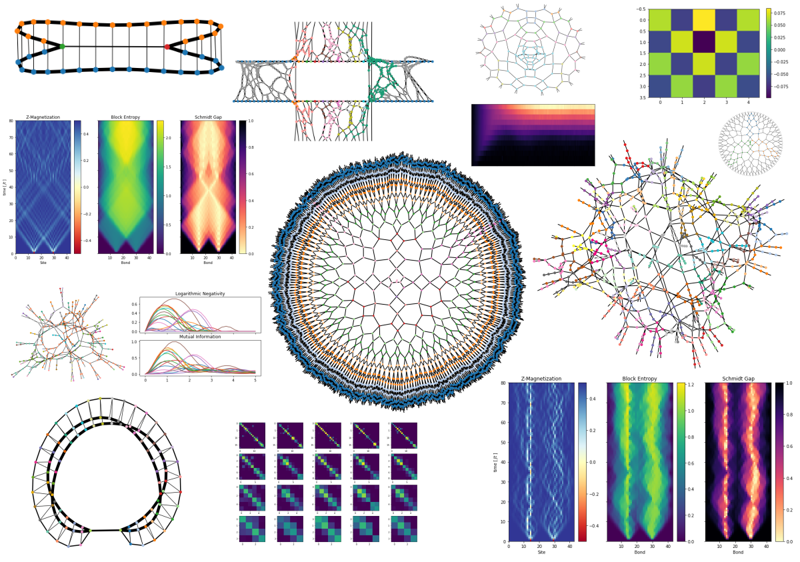

Welcome to quimb's documentation!
=================================

.. image:: https://travis-ci.org/jcmgray/quimb.svg?branch=master
  :target: https://travis-ci.org/jcmgray/quimb
  :alt: Travis-CI
.. image:: https://codecov.io/gh/jcmgray/quimb/branch/master/graph/badge.svg
  :target: https://codecov.io/gh/jcmgray/quimb
  :alt: Code Coverage
.. image:: https://img.shields.io/lgtm/grade/python/g/jcmgray/quimb.svg
  :target: https://lgtm.com/projects/g/jcmgray/quimb
  :alt: Code Quality
.. image:: https://readthedocs.org/projects/quimb/badge/?version=latest
  :target: http://quimb.readthedocs.io/en/latest/?badge=latest
  :alt: Documentation Status
.. image:: http://joss.theoj.org/papers/10.21105/joss.00819/status.svg
  :target: https://doi.org/10.21105/joss.00819
  :alt: JOSS Paper

----------------------------------------------------------------------------------

`quimb <https://github.com/jcmgray/quimb>`_ is an easy but fast python library for quantum information and many-body calculations, including with tensor networks. The code is hosted on `github <https://github.com/jcmgray/quimb>`_, do please submit any issues or pull requests there. It is also thoroughly unit-tested and the tests might be the best place to look for detailed documentation.

The **core** ``quimb`` module:

* Uses straight ``numpy`` and ``scipy.sparse`` matrices as quantum objects
* Accelerates and parallelizes many operations using `numba <https://numba.pydata.org>`_.
* Makes it easy to construct operators in large tensor spaces (e.g. 2D lattices)
* Uses efficient methods to compute various quantities including entanglement measures
* Has many built-in states and operators, including those based on fast, parallel random number generation
* Can perform evolutions with several methods, computing quantities on the fly
* Has an optional `slepc4py <https://bitbucket.org/slepc/slepc4py>`_ interface for easy distributed (MPI) linear algebra. This can massively increase the performance when seeking, for example, mid-spectrum eigenstates

The **tensor network** submodule ``quimb.tensor``:

* Uses a geometry free representation of tensor networks
* Uses `opt_einsum <https://github.com/dgasmith/opt_einsum>`_ to find efficient contraction orders for hundreds or thousands of tensors
* Can perform those contractions on various backends, including with a GPU
* Can plot any network, color-coded, with bond size represented
* Can treat any network as a scipy ``LinearOperator``, allowing many decompositions
* Can perform DMRG1, DMRG2 and DMRGX, in matrix product state language
* Has tools to efficiently address periodic problems (transfer matrix compression and pseudo-orthogonalization)
* Can perform MPS time evolutions with TEBD

Guides
------

The following guides give a basic introduction to the various parts:

.. toctree::
  :numbered:
  :maxdepth: 1

  installation
  basics
  generate
  calculating quantities
  solving systems
  distributed parallelism - mpi
  dynamics and evolution
  tensor-basics
  tensor-algorithms
  develop

.. _examples:

Examples
--------

The following examples, generated from the notebooks in ``docs/examples``, demonstrate some more advanced features or complete usage:

.. toctree::
  :maxdepth: 1

  ./examples/ex_2d
  ./examples/ex_quench
  ./examples/ex_distributed_shift_invert
  ./examples/ex_tn_rand_uni_gate_graphs
  ./examples/ex_dmrg_periodic
  ./examples/ex_TEBD_evo
  ./examples/ex_quantum_circuit
  ./examples/ex_MERA
  ./examples/ex_torch_optimize_pbc_mps

Citing
------

``quimb`` is published in the Journal of Open Source Software `here <https://doi.org/10.21105/joss.00819>`_ - if it's ever useful in research please consider citing it!

.. code-block:: latex

    @article{gray2018quimb,
      title={quimb: a python library for quantum information and many-body calculations},
      author={Gray, Johnnie},
      journal={Journal of Open Source Software},
      year = {2018},
      volume={3}, number={29}, pages={819},
      doi={10.21105/joss.00819},
    }

Indices and tables
------------------

The following sections contain the complete listing of functions, classes and modules in ``quimb``.

* :ref:`genindex`
* :ref:`modindex`
* :ref:`search`

