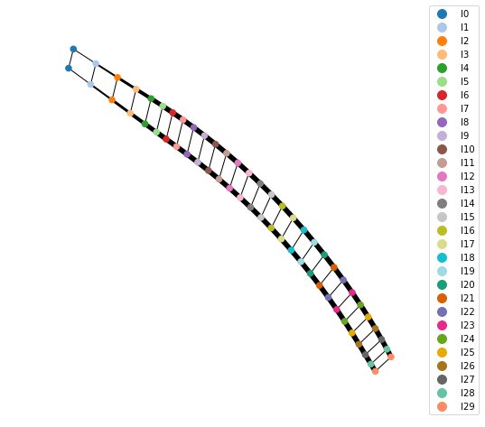
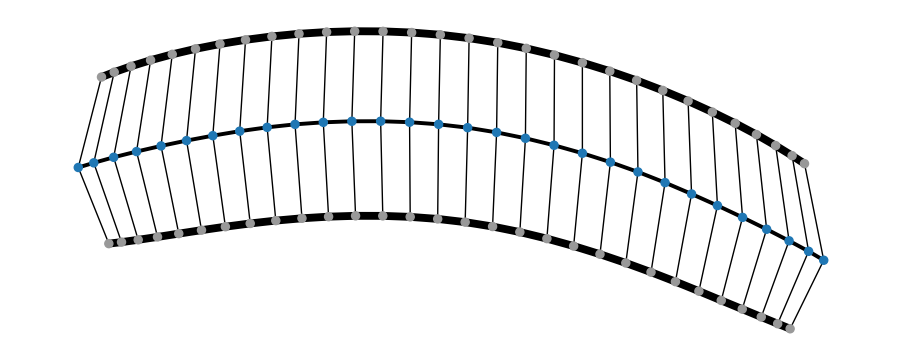

#################
Tensor Algorithms
#################

Currently implemented algorithms
--------------------------------

Static:

    * 1-site :class:`~quimb.tensor.tensor_dmrg.DMRG1` (OBC and PBC)
    * 2-site :class:`~quimb.tensor.tensor_dmrg.DMRG2` (OBC and PBC)
    * 1-site :class:`~quimb.tensor.tensor_dmrg.DMRGX`

Time Evolving:

    * :class:`~quimb.tensor.tensor_tebd.TEBD`

Should be fairly easily to implement / planned:

    * 2-site DMRG-X
    * 1-site TDVP
    * 2-site TDVP

1D tensor networks
------------------

Generate a random :class:`~quimb.tensor.tensor_1d.MatrixProductState`, and contract its inner product:

.. code-block:: python

    >>> p = MPS_rand_state(n=30, bond_dim=50)
    >>> p.H @ p
    1.0000000000000009

    >>> p.show()
     50 50 50 50 50 50 50 50 50 50 50 50 50 50 50 50 50 50 50 50 50 50 50 50 50 50 50 50 50
    o--o--o--o--o--o--o--o--o--o--o--o--o--o--o--o--o--o--o--o--o--o--o--o--o--o--o--o--o--o
    |  |  |  |  |  |  |  |  |  |  |  |  |  |  |  |  |  |  |  |  |  |  |  |  |  |  |  |  |  |

    >>> p.left_canonize()
    >>> p.show()
     2 4 8 16 32 50 50 50 50 50 50 50 50 50 50 50 50 50 50 50 50 50 50 50 50 50 50 50 50
    >->->->-->-->-->-->-->-->-->-->-->-->-->-->-->-->-->-->-->-->-->-->-->-->-->-->-->--o
    | | | |  |  |  |  |  |  |  |  |  |  |  |  |  |  |  |  |  |  |  |  |  |  |  |  |  |  |

    >>> p.H @ p
    0.9999999999999991

The ``show`` method is specific to 1D networks. We can also plot a graph, as with any network, of the uncontracted inner product of the MPS with itself:

.. code-block:: python

    (p.H & p).graph(color=[f'I{i}' for i in range(30)])

Here we used the fact that 1D tensor networks are tagged with the structure ``"I{}"`` denoting their sites.

We can also add MPS and compress:

.. code-block:: python

    >>> p2 = (p + p) / 2
    >>> p2.show()
     100 100 100 100 100 100 100 100 100 100 100 100 100 100 100 100 100 100 100 10
    o===o===o===o===o===o===o===o===o===o===o===o===o===o===o===o===o===o===o===o== ...
    |   |   |   |   |   |   |   |   |   |   |   |   |   |   |   |   |   |   |   |

    >>> p2.compress(form=20)
    >>> p2.show()
     2 4 8 16 32 50 50 50 50 50 50 50 50 50 50 50 50 50 50 50 50 50 50 50 32 16 8 4 2
    >->->->-->-->-->-->-->-->-->-->-->-->-->-->-->-->-->-->--o--<--<--<--<--<--<-<-<-<
    | | | |  |  |  |  |  |  |  |  |  |  |  |  |  |  |  |  |  |  |  |  |  |  |  | | | |

    >>> p2.H @ p2
    0.9999999999999998

Could also calculate the following:

- :meth:`~quimb.tensor.tensor_1d.MatrixProductState.entropy` (OBC only)
- :meth:`~quimb.tensor.tensor_1d.MatrixProductState.schmidt_gap` (OBC only)
- :meth:`~quimb.tensor.tensor_1d.MatrixProductState.correlation`
- :meth:`~quimb.tensor.tensor_1d.MatrixProductState.logneg_subsys`

and various out quantities such as the mutual information using a combination of - :meth:`~quimb.tensor.tensor_1d.MatrixProductState.partial_trace_compress` and :func:`~quimb.approx_spectral_function` (see :ref:`Examples`).

Generate a random hermitian :class:`~quimb.tensor.tensor_1d.MatrixProductOperator` and form a 'overlap' network with our MPS:

.. code-block:: python

    >>> A = MPO_rand_herm(30, bond_dim=7, tags=['_HAM'])
    >>> pH = p.H
    >>> align_TN_1D(pH, A, p, inplace=True);
    >>> (pH & A & p).graph(color='_HAM')

Compute the actual contraction:

    >>> (pH & A & p) ^ ...
    -1.2069781127179028e-29

Building Hamiltonians
---------------------

There a few built-in MPO hamiltoanians:

* :class:`~quimb.tensor.tensor_gen.MPO_ham_heis`
* :class:`~quimb.tensor.tensor_gen.MPO_ham_ising`
* :class:`~quimb.tensor.tensor_gen.MPO_ham_XY`
* :class:`~quimb.tensor.tensor_gen.MPO_ham_mbl`

These all accept a ``cyclic`` argument to enable periodic boundary conditions (PBC), and a ``S`` argument to set the size of spin.

For generating other spin Hamiltonians see :class:`~quimb.tensor.tensor_gen.MPOSpinHam`, or consider using the raw constructor of :class:`~quimb.tensor.tensor_1d.MatrixProductOperator`.

Example of DMRG2 calcuation
---------------------------

First we build a Hamiltonian term by term (though we could just use :class:`~quimb.tensor.tensor_gen.MPO_ham_heis`:

.. code-block:: python

    from quimb.tensor import MPOSpinHam, DMRG2
    builder = MPOSpinHam(S=1)
    builder.add_term(1/2, '+', '-')
    builder.add_term(1/2, '-', '+')
    builder.add_term(1, 'Z', 'Z')
    ham = builder.build(n=100)

Then we construct the 2-site DMRG object (:class:`~quimb.tensor.tensor_dmrg.DMRG2`), with a default sequence of maximum bond dimensions and a bond compression cutoff:

.. code-block:: python

    dmrg = DMRG2(ham, bond_dims=[10, 20, 100, 100, 200], cutoffs=1e-10)

The ``DMRG`` object will automatically detect OBC/PBC. Now we can solve to a certain absolute energy tolerance, showing progress and a schematic of the final state:

.. code-block:: python

    >>> dmrg.solve(tol=1e-6, verbosity=1)
    SWEEP-1, direction=R, max_bond=10, cutoff:1e-10
    100%|███████████████████████████████████████████| 99/99 [00:01<00:00, 75.66it/s]
    Energy: -138.73797893126138 ... not converged
    SWEEP-2, direction=R, max_bond=20, cutoff:1e-10
    100%|██████████████████████████████████████████| 99/99 [00:00<00:00, 442.40it/s]
    Energy: -138.93684387336182 ... not converged
    SWEEP-3, direction=R, max_bond=100, cutoff:1e-10
    100%|███████████████████████████████████████████| 99/99 [00:01<00:00, 53.31it/s]
    Energy: -138.9400480376106 ... not converged
    SWEEP-4, direction=R, max_bond=100, cutoff:1e-10
    100%|███████████████████████████████████████████| 99/99 [00:09<00:00, 10.24it/s]
    Energy: -138.9400856058551 ... not converged
    SWEEP-5, direction=R, max_bond=200, cutoff:1e-10
    100%|███████████████████████████████████████████| 99/99 [00:15<00:00,  6.36it/s]
    Energy: -138.9400860644765 ... converged!
    Out[8]: True

    >>> dmrg.state.show()
         3 9 27 55 65 74 79 84 87 89 91 93 94 95 95 95 95 94 94 94 93 93 92 92 91 91 90 90 90 90 90 90 90 90 90 90 90 90 90 90 9
        >->->-->-->-->-->-->-->-->-->-->-->-->-->-->-->-->-->-->-->-->-->-->-->-->-->-->-->-->-->-->-->-->-->-->-->-->-->-->-->- ...
        | | |  |  |  |  |  |  |  |  |  |  |  |  |  |  |  |  |  |  |  |  |  |  |  |  |  |  |  |  |  |  |  |  |  |  |  |  |  |  |
                                                              ...
        0 90 90 90 90 90 90 90 90 90 90 90 90 90 90 90 90 90 90 90 90 90 90 90 90 90 90 90 90 90 90 90 90 90 91 91 90 91 91 91 9
    ... ->-->-->-->-->-->-->-->-->-->-->-->-->-->-->-->-->-->-->-->-->-->-->-->-->-->-->-->-->-->-->-->-->-->-->-->-->-->-->-->- ...
         |  |  |  |  |  |  |  |  |  |  |  |  |  |  |  |  |  |  |  |  |  |  |  |  |  |  |  |  |  |  |  |  |  |  |  |  |  |  |  |
                                                              ...
        2 95 96 96 96 96 96 95 92 90 87 83 78 73 64 53 27 9 3
    ... ->-->-->-->-->-->-->-->-->-->-->-->-->-->-->-->-->->-o
         |  |  |  |  |  |  |  |  |  |  |  |  |  |  |  |  | | |

There are many options stored in the dict ``DMRG.opts`` - an explanation of each of these is given in :func:`~quimb.tensor.tensor_dmrg.get_default_opts`, and it may be neccesarry to tweak these to achieve the best performance/accuracy, especially for PBC (see :ref:`examples`).

Performance tips
----------------

    1. Make sure numpy is linked to a fast BLAS (e.g. MKL version that comes with conda).
    2. Install slepc4py, to use as the iterative eigensolver, it's faster than scipy.
    3. If the hamiltonian is real, compile and use a real version of SLEPC (set the environment variable PETSC_ARCH before launch).
