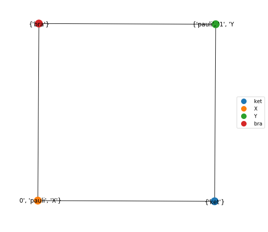

#####################
Tensor Network Basics
#####################

The tensor functionality is stored in ``quimb.tensor`` and not imported by default.

.. code-block:: python

    >>> from quimb import *
    >>> from quimb.tensor import *

The core functions of note are :class:`~quimb.tensor.tensor_core.Tensor`, :class:`~quimb.tensor.tensor_core.TensorNetwork`, :func:`~quimb.tensor.tensor_core.tensor_contract`, and :func:`~quimb.tensor.tensor_core.tensor_split`.

Basic Manipulations
-------------------

Creating a :class:`~quimb.tensor.tensor_core.Tensor`:

.. code-block:: python

    ket = Tensor(bell_state('psi-').reshape(2, 2), inds=('k0', 'k1'), tags={'ket'})
    X = Tensor(pauli('X'), inds=('k0', 'b0'), tags={'pauli', 'X', '0'})
    Y = Tensor(pauli('Y'), inds=('k1', 'b1'), tags={'pauli', 'Y', '1'})
    bra = Tensor(rand_ket(4).reshape(2, 2), inds=('b0', 'b1'), tags={'bra'})

Can now combine these into a network (``.H`` conjugates the data).

.. code-block:: python

    TN = ket.H & X & Y & bra

Plot your creation:

.. code-block:: python

    TN.graph(color=['ket', 'X', 'Y', 'bra'])

Contract everything (with optimized contraction order):

.. code-block:: python

    >>> TN ^ ...
    (0.7212531527120138-0.03982265659016575j)

Or just the paulis:

.. code-block:: python

    >>> print(TN ^ 'pauli')
    TensorNetwork([
        Tensor(shape=(2, 2), inds=('k0', 'k1'), tags={'ket'}),
        Tensor(shape=(2, 2), inds=('b0', 'b1'), tags={'bra'}),
        Tensor(shape=(2, 2, 2, 2), inds=('k0', 'b0', 'k1', 'b1'), tags={'Y', 'X', '0', 'pauli', '1'}),
    ])

Get the ket, split it in half and replace the original:

.. code-block:: python

    >>> Tk_s = TN['ket'].split(left_inds=['k0'])
    >>> print(Tk_s)  # note new index created
    TensorNetwork([
        Tensor(shape=(2, 2), inds=('k0', '_89dcdf0000016'), tags={'ket'}),
        Tensor(shape=(2, 2), inds=('_89dcdf0000016', 'k1'), tags={'ket'}),
    ])

    >>> del TN['ket']
    >>> TN &= Tk_s
    >>> TN ^ ...
    (0.7212531527120138-0.03982265659016575j)

Indices connecting Tensors or TensorNetworks can also be found using :func:`~quimb.tensor.tensor_core.bonds`.

Other overloads
---------------

You can also add tensors/networks together using ``|`` or the inplace ``|=``, which act like ``&`` and ``&=`` respectively, but are virtual, meaning that changes to the tensors propogate across all networks viewing it (see :class:`~quimb.tensor.tensor_core.TensorNetwork`).

The ``@`` symbol is overloaded to combine the objects into a network and then contract them all, and so mimics dense dot product. E.g.

.. code-block:: python

    >>> ket.H @ ket
    >>> 1.0

In this case, the conjugated copy ``ket.H`` has the same outer indices as ``ket`` and so the inner product is naturally formed.

Internal Structure
------------------

A :class:`~quimb.tensor.tensor_core.TensorNetwork` stores its tensors in three dictionaries  which allow them to be selected in constant time, regardless of network size, based on their ``tags`` and ``inds``. These are

- ``TensorNetwork.tensor_map``: a mapping of unique string ids (``tids``) to each tensor
- ``TensorNetwork.tag_map``: a mapping of every tag in the network to the set of ``tids``
  corresponding to tensors which have that tag.
- ``TensorNetwork.ind_map``: a mapping of every index in the network to the set of ``tids``
  corresponding to tensors which that that index.

Each :class:`~quimb.tensor.tensor_core.Tensor` contains a ``weakref.ref`` to each :class:`~quimb.tensor.tensor_core.TensorNetwork` it has been added to (its ``owners``), so that these maps can be updated whenever the tensor is modified directly.

Thus the tensors with tag ``'HAM'`` in network ``tn`` would be ``(tn.tensor_map[tid] for tid in tn.tag_map['HAM'])`` etc. The geometry of the network is thus completely defined by which indices appear twice, and how you label the tensors with tags in order to select them.

This allows any tagging strategy/structure can be used to place/reference/remove tensors etc. For example the default tags a 1D tensor network uses are ``('I0', 'I1', 'I2', ...)`` with physical inds ``('k0', 'k1', 'k2', ...)``. A 2D network might use  tags ``('I0J0', 'I0J1', 'I0J2', 'I1J0', ...)`` etc.

To select a subset or partition a network into tensors that match any or all of a set of tags see :func:`~quimb.tensor.tensor_core.TensorNetwork.select` or :func:`~quimb.tensor.tensor_core.TensorNetwork.partition`.

Contraction Backend
-------------------

The tensor contractions can be performed with any backend supported by `opt_einsum <http://opt-einsum-jcmgray.readthedocs.io/en/latest/backends.html>`_, including several which use the GPU. These are specified with the ``backend`` argument to :func:`~quimb.tensor.tensor_core.tensor_contract` and any related functions, or by setting a default backend using :func:`~quimb.tensor.tensor_core.set_tensor_backend`.
