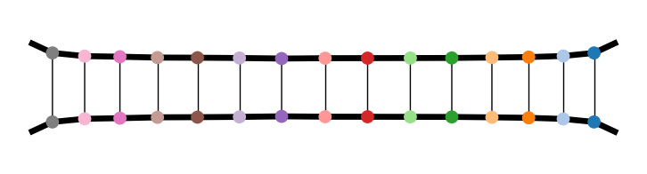

# Summary

The language of quantum physics is essentially linear algebra, making it easy to begin simulating using standard numerical routines.
However, the amount of classical resources required to simulate a quantum system scales exponenially with its size.
This imposes, in the generic case, dramatic limits on the sizes reachable and requires that great care is taken in order to maximise performance.
Nonetheless, and in part due to this difficulty, there is much to be learnt from simulating many-body quantum systems.
One useful set of tools in this case is quantum information inspired quantities such as entanglement meausures.
Entanglement is also the key quantity when formulating tensor networks, an efficient representation of certain many-body quantum states. ``quimb`` is a pure python library that covers all these areas, with an emphasis on being interactive and easy to use without sacrificing performance.

The main ``quimb`` module utilizes numpy [@numpy] and scipy [@scipy] sparse matrices to represent quantum states and operators.
Amongst other things there are tools to: (i) construct states and operators in composite tensor spaces; (ii) generate various special or random states and operators such as Hamiltonians; (iii) perform and compute many operations and quantities on these states; and (iv) efficiently evolve states with a variety of methods.
Much of this core functionality is accelerated with ``numba`` or ``numexpr``. Additionally, ``quimb`` has an optional ``slepc4py`` [@hernandez2005slepc; @dalcin2011parallel] interface for various linear algebra routines, such as eigen-decomposition. 
These are accessed through unified functions so that one can easily switch between ``slepc4py``, ``scipy`` and other backends.
When required, ``quimb`` handles spawning local ``mpi4py`` [@mpi4py] workers automatically, but there also tools for explicitly running under MPI, for example on a cluster. 
The following snippet illustrates some basic usage:

```python
>>> import quimb as qu

>>> psi_0 = qu.rand_product_state(n=16)
>>> H = qu.ham_heis(n=16, sparse=True)

>>> evo = qu.Evolution(psi_0, H, progbar=True)
>>> evo.update_to(1)
100%|███████████████████████████████████████| 100/100 [00:00<00:00, 292.51%/s]

>>> dims = [2] * 16
>>> sysa, sysb = [7, 8, 9], [10, 11, 12]
>>> qu.logneg_subsys(evo.pt, dims, sysa, sysb)
0.7719264840262068
```

The submodule ``quimb.tensor`` has a more speciliazed set of tools that focus on tensor networks [@tensor-networks] - one of the key recent advancements in many-body quantum theory. 
General highlights of ``quimb.tensor`` include: (i) an efficient, geometry free representation of arbitrary tensor networks; (ii) automatic contraction of 100s-1000s of tensors using ``opt_einsum`` [@opt_einsum], including on the GPU; (iii) the ability to plot any tensor network, color-coded, with bond-sizes represented; and (iv) the ability to treat any network as a ``LinearOperator``, allowing many iterative decompositions such as those in ``scipy``. Based on these, fast versions of 1D tensor network algorithms such as DMRG and TEBD are implemented, as well as tools for efficiently dealing with periodic boundary conditions.
The following snippet illustrates some usage of ``quimb.tensor``:

```python
>>> import quimb.tensor as qtn

>>> # set up a MPO Hamiltonian and DMRG object, solve it
>>> H = qtn.MPO_ham_heis(100)
>>> dmrg = qtn.DMRG2(H)
>>> dmrg.solve(max_sweeps=3, verbosity=1)
SWEEP-1, direction=R, max_bond=8, cutoff:1e-08
100%|█████████████████████████████████████████| 99/99 [00:02<00:00, 46.42it/s]
Energy: -43.97194198907086 ... not converged.
SWEEP-2, direction=R, max_bond=16, cutoff:1e-08
100%|████████████████████████████████████████| 99/99 [00:00<00:00, 117.69it/s]
Energy: -44.111515305613054 ... not converged.
SWEEP-3, direction=R, max_bond=32, cutoff:1e-08
100%|████████████████████████████████████████| 99/99 [00:00<00:00, 196.39it/s]
Energy: -44.12521153106866 ... not converged.

>>> # find the half chain entropy
>>> gs = dmrg.state
>>> gs.entropy(50)
1.2030121785347394

>>> # lazily form <psi|psi>, select 15 sites, and plot (see figure 1.)
>>> (gs.H & gs)[30:45].graph(color=['I{}'.format(i) for i in range(30, 45)])
```



Overall, ``quimb`` aims to be an accessible but capable approach to simulating quantum many-body problems, and has been used already in a number of publications[@gray2016unravelling; @gray2018many; @gray2017measuring]. The full documentation can be found online at http://quimb.readthedocs.io/en/latest/.


# Acknowledgements

JG acknowledges funding from the EPSRC Centre for Doctoral Training in Delivering Quantum Technologies at UCL.


# References
